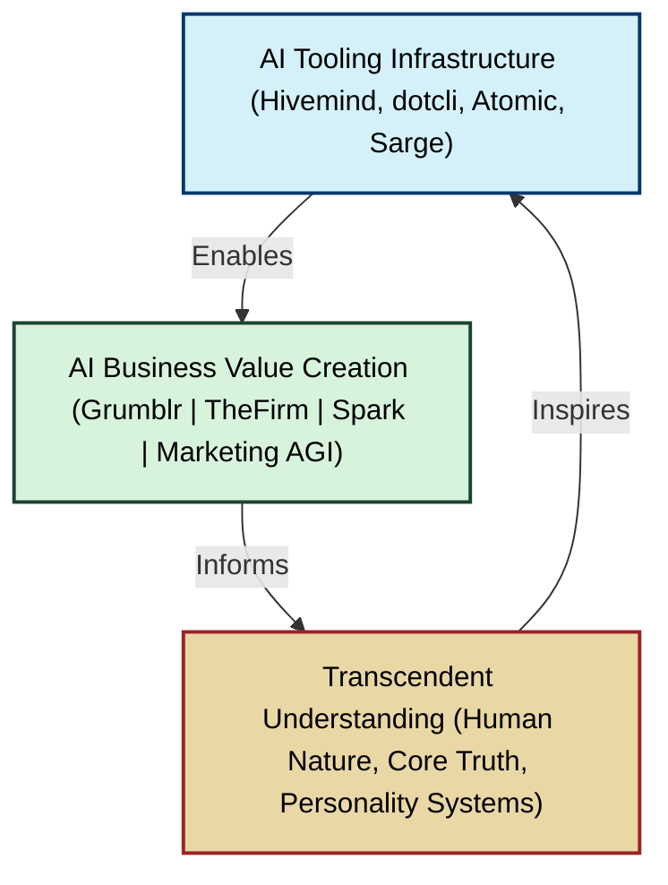

Dreaming of a world of peace and abundance.

**Mission**: Creating a diversified holding company that builds businesses to discover and reignite the natural spark in every person through technology, media, and service initiatives.

**Structure**: Ten complementary subsidiaries working in synergy: Venture Studio, Investment Bank, Publisher, Tech Consulting, Media Company, Parenting & Marriage Division, Innovation Consulting, AI Training/Events, Global Service Organization, and Think Tank.

**Market Thesis:** Addressing critical societal shifts:
* Technological disruption (AI and automation changing work and living patterns)
* Social breakdown (declining family structures and community bonds)
* Cognitive changes (rising ADHD, neurodivergence becoming mainstream)
* Crisis of masculinity (absent fathers, declining male participation in education/workforce)
* Shifting gender dynamics (reduction in traditional masculinity coupled with emerging profiles of men who are both empathetic and emotionally volatile)
* Identity fragmentation (people struggling to integrate purpose, faith, and modern realities)
* Barriers to communication
* Zombie living

**Target Markets:** Six primary audiences: 
1. Men with ADHD (15-50)
2. Creators with business dreams
3. Homeschoolers
4. Mission driven organizations work for human abundance
5. Tech professionals
6. People with mental health challenges.

**Leadership**: Team of polymaths from world-class companies (Google, Palantir, McKinsey, Harvard, Amazon, ) and recovered addicts who combine technical excellence with lived experience and spiritual purpose.

**Synergy Strategy**: Each subsidiary reinforces the others - media promotes consulting, consulting creates leads for training, publishing powers thought leadership, service builds credibility.

**Funding Structure**: $1B seed capital deployed across three phases: Foundation ($50M), Expansion ($200M), and Global Movement ($750M).

**Products Portfolio**: Includes ADHD-friendly productivity tools, venture funding mechanisms, faith-based media content, family support systems, and creator empowerment technologies.

**Ultimate Vision**: Elevating global society through a movement of transcendent creationism that:
Shifts humanity from historical constraints of poverty and scarcity toward a vision of "heaven on earth" where each person fulfills their potential.  Combines the authenticity of popular culture figures (Joe Rogan, Brene Brown, Malcolm Gladwell) with the hope-filled evangelism of Billy Graham.

Implements Rick Warren's purpose-driven principles through practical technological systems
Advances MLK's vision of beloved community by creating equitable access to creation tools
Builds connection platforms with Facebook's scale but designed for genuine community and human flourishing

Develops an American-made apparel and lifestyle brand rivaling Lululemon or Under Armour that embodies quality craftsmanship, ethical production, and spiritual values through everyday products

Creates brands like PUMA that integrate style, function, and meaning for faith-aligned audiences

Applies neuroscience (behavioral economics, neuroeconomics, political science) to design systems aligned with human nature and spiritual growth

Culminates in funding and launching Lighthouse  Boston in 2050 as a physical manifestation where technology, culture, science, and faith converge to demonstrate abundant living principles in action.

## Project Diagrams

- [High Level Overview](./highlevel-diagram.md)
- [Detailed Structure](./detailed-diagram.md)
- [AI Tooling](./aitooling-diagram.md)
- [AI Business Value](./aibizvalue-diagram.md)
- [Core Human Truth](./corehumantruth-diagram.md)

## About Andy Hopper

**Origins:**
Andy comes from a long line of polymath adventures, creators, and explorers.  His ancestors came to America in the 1700s.  Andrew is related to Thomas Jefferson and other founding fathers of America including the Randolph family who helped to start Virginia Tech.

His mother a product of a polymath farmboy who happened to luck into a scholarship to Cornell in the 1930s and a daughter of a Gatsby era aristocrat who made millions in the Great Depression; his dad the product of Fran Hopper the first woman to break into the comic industry in the 1940s working with Marvel and her husband Dr. John Hopper, a UPenn educated physican, the son of a Dutch judge, who delivered over 3000 babies, bred horses, and sailed around the world.  

Pattern matching and adventure is deeply core to Andrew's life experience and genetic origins.

Andrew is the product of a highly creative, rational, analytic, and empathetic father who worked as a metallurgical engineer, and a mother who studied law and philosophy, saw the good in everyone, and recognized opportunity in all situations. A fusion between a world-class systems thinker and a mother with a heart for others that may rival Mother Teresa.

**Goals:**
Andrew has been a "seeker" his entire life, continuously searching for the enduring equation that persists as lim (n→∞) of life (career + family + ...).

**Key Apprenticeship Opportunities:**
- 2002-2005: Bootstrapped SaaS company, studied under product expert Eric Nelson, influenced by Seth Godin
- 2006-2009: Built AI-native real estate brokerage, studied under brilliant entrepreneur Michael Bean
- 2009-2011: Global brand building at PUMA, studied under Tony Bertone
- 2011-2015: Studied under brilliant PR, community, and marketing expert Jack Barette
- 2015-2017: Studied under world-renowned mindfulness and addiction expert Jud Brewser
- 2020: Studied at Hopper under brilliant PR experts and technologists
- 2020-2025: Worked at AWS, directly learning from over 1,000 leading-edge startups

**Key Turning Point:**
* The release of Claude summer 2024 - which enables AI to code, allowing for meta-acceleration

