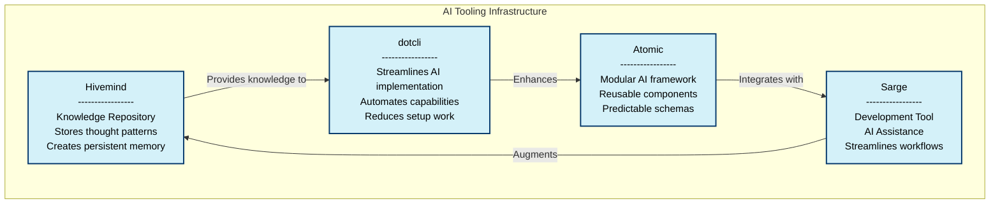

# AI Tooling Infrastructure

This diagram details our AI tooling infrastructure components and their relationships.

```mermaid
flowchart TD
    subgraph "AI Tooling Infrastructure"
        HM["Hivemind\n-----------------\nKnowledge Repository\nStores thought patterns\nCreates persistent memory"]
        
        DC["dotcli\n-----------------\nStreamlines AI implementation\nAutomates capabilities\nReduces setup work"]
        
        AT["Atomic\n-----------------\nModular AI framework\nReusable components\nPredictable schemas"]
        
        SG["Sarge\n-----------------\nDevelopment Tool\nAI Assistance\nStreamlines workflows"]
    end
    
    HM -->|"Provides knowledge to"| DC
    DC -->|"Enhances"| AT
    AT -->|"Integrates with"| SG
    SG -->|"Augments"| HM
    
    classDef tooling fill:#d4f1f9,stroke:#05386B,stroke-width:2px,color:black
    
    class HM,DC,AT,SG tooling
```

[Back to README](Readme.md.md) 