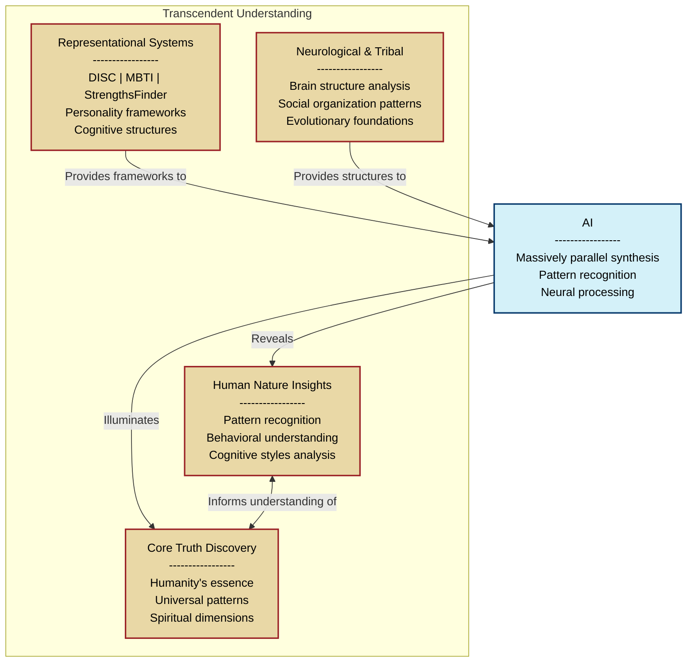

# Core Human Truth

This diagram explores our understanding of transcendent human truths and how AI helps illuminate them.

```mermaid
flowchart TD
    subgraph "Transcendent Understanding"
        HN["Human Nature Insights\n-----------------\nPattern recognition\nBehavioral understanding\nCognitive styles analysis"]
        
        CT["Core Truth Discovery\n-----------------\nHumanity's essence\nUniversal patterns\nSpiritual dimensions"]
        
        RS["Representational Systems\n-----------------\nDISC | MBTI | StrengthsFinder\nPersonality frameworks\nCognitive structures"]
        
        NS["Neurological & Tribal\n-----------------\nBrain structure analysis\nSocial organization patterns\nEvolutionary foundations"]
    end
    
    AI["AI\n-----------------\nMassively parallel synthesis\nPattern recognition\nNeural processing"]
    
    RS -->|"Provides frameworks to"| AI
    NS -->|"Provides structures to"| AI
    AI -->|"Reveals"| HN
    AI -->|"Illuminates"| CT
    HN <-->|"Informs understanding of"| CT
    
    classDef transcend fill:#e9d8a6,stroke:#9b2226,stroke-width:2px,color:black
    classDef ai fill:#d4f1f9,stroke:#05386B,stroke-width:2px,color:black
    
    class HN,CT,RS,NS transcend
    class AI ai
```

[Back to README](./README.md) 