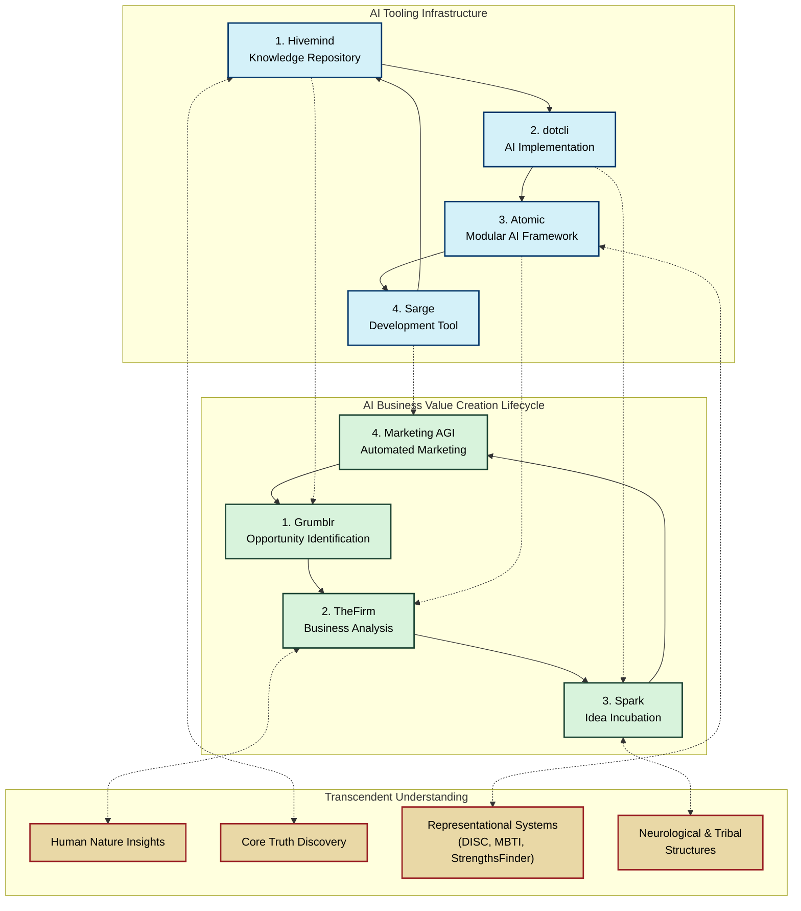

# Detailed Structure

This diagram provides a detailed view of the components in our three main systems and how they interact.

```mermaid
flowchart TD
    %% Main categorization
    subgraph "AI Tooling Infrastructure"
        HM["1. Hivemind\nKnowledge Repository"]
        DC["2. dotcli\nAI Implementation"]
        AT["3. Atomic\nModular AI Framework"]
        SG["4. Sarge\nDevelopment Tool"]
    end

    subgraph "AI Business Value Creation Lifecycle"
        GB["1. Grumblr\nOpportunity Identification"]
        TF["2. TheFirm\nBusiness Analysis"]
        SP["3. Spark\nIdea Incubation"]
        MA["4. Marketing AGI\nAutomated Marketing"]
    end

    subgraph "Transcendent Understanding"
        TP["Human Nature Insights"]
        CT["Core Truth Discovery"]
        RS["Representational Systems\n(DISC, MBTI, StrengthsFinder)"]
        NS["Neurological & Tribal\nStructures"]
    end

    %% Infrastructure connections
    HM --> DC
    DC --> AT
    AT --> SG
    SG --> HM
    
    %% Business Value connections
    GB --> TF
    TF --> SP
    SP --> MA
    MA --> GB
    
    %% Cross-group connections
    HM -.-> GB
    AT -.-> TF
    DC -.-> SP
    SG -.-> MA
    
    %% Transcendent connections
    HM <-.-> CT
    TF <-.-> TP
    AT <-.-> RS
    SP <-.-> NS
    
    classDef infra fill:#d4f1f9,stroke:#05386B,stroke-width:2px,color:black
    classDef business fill:#d8f3dc,stroke:#1b4332,stroke-width:2px,color:black
    classDef transcend fill:#e9d8a6,stroke:#9b2226,stroke-width:2px,color:black
    
    class HM,DC,AT,SG infra
    class GB,TF,SP,MA business
    class TP,CT,RS,NS transcend
```

[Back to README](316,%20Inc.md) 